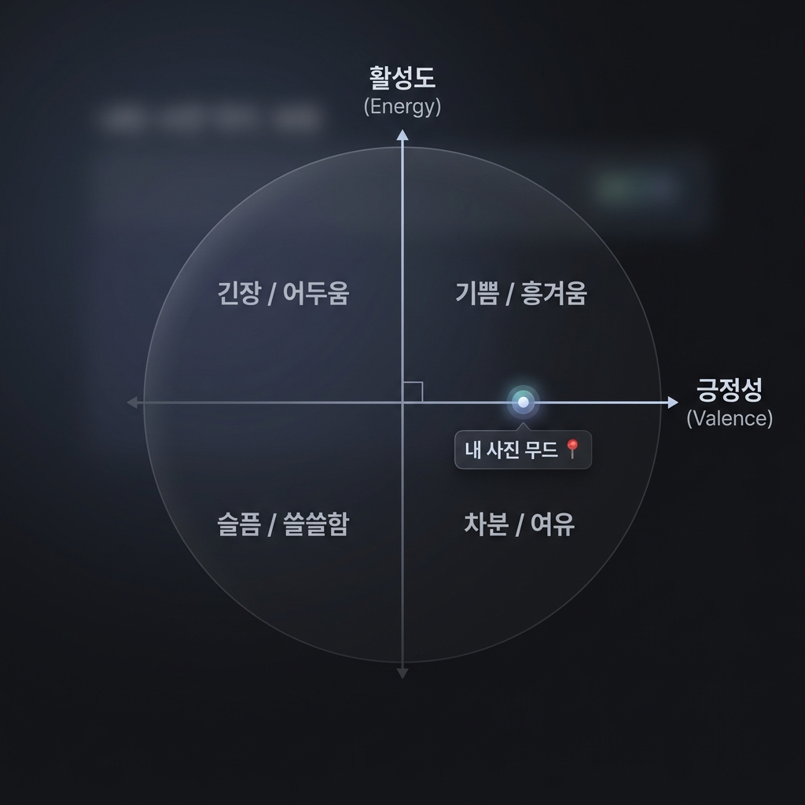
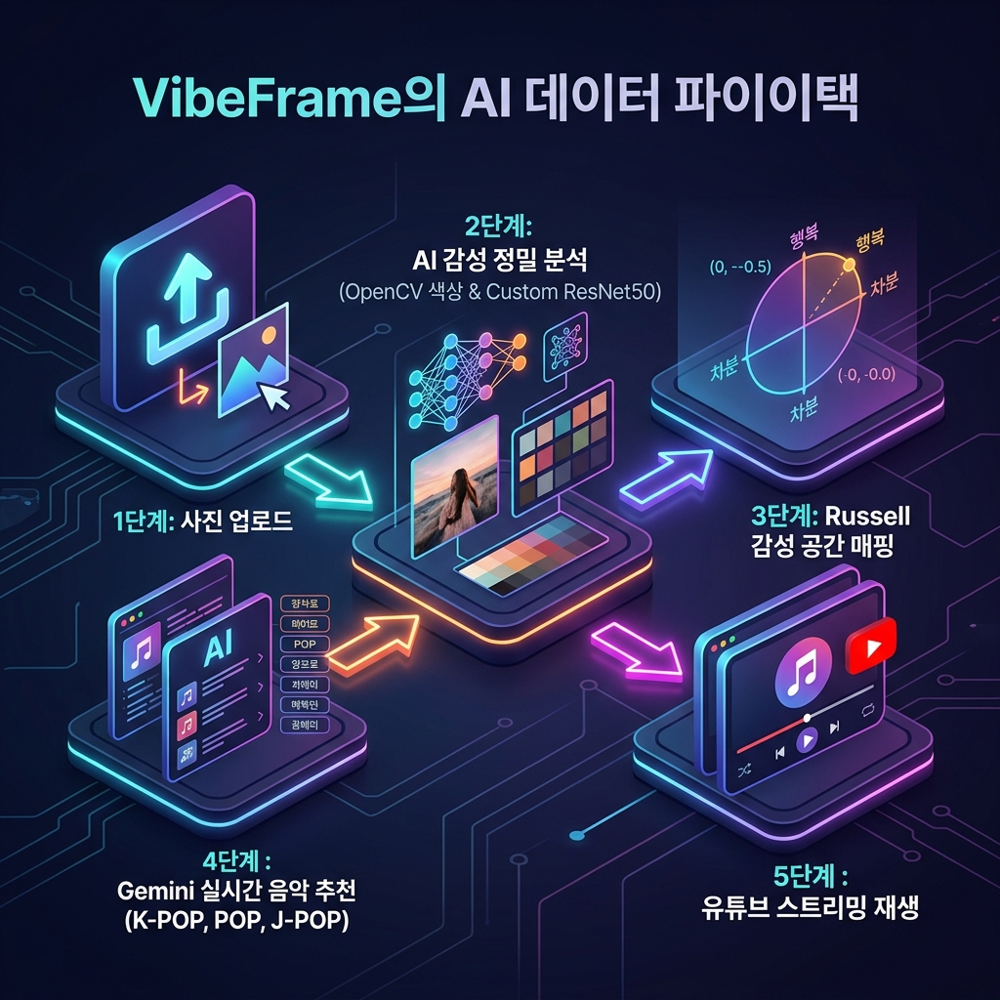

# 🎵 VibeFrame (바이브프레임)
> **AI 기반 이미지 감성 분석 및 실시간 사운드스페이스 큐레이션 서비스**  
> *AI-based Image Sentiment Analysis & Real-time Soundtrack Curation Service*

  
  
  
  

---

## 📌 1. 프로젝트 요약 (Project Summary)

| 항목 | 상세 내용 |
| :--- | :--- |
| **프로젝트명** | **VibeFrame (바이브프레임)** |
| **개발 목적** | 사용자가 업로드한 **사진(이미지) 속 감성 좌표**를 실시간으로 스캔 및 분석하여 최적의 **사운드스페이스(음악 추천)를 매칭**하는 인공지능 엔터테인먼트 플랫폼 |
| **핵심 기술** | **Custom ResNet50 (PyTorch Regression)**, **OpenCV 감성 팔레트 스캔**, **Russell 2차원 감성 모델 매핑**, **Google Gemini 2.5 Flash API**, **실시간 유튜브 무권한 음악 스트리밍 연동** |
| **개발 환경** | Python 3.10+, PyTorch (GeForce RTX 4060 GPU 가속 학습 완료), Streamlit Premium UI |

---

## 🚀 2. 추진 배경 및 필요성 (Background & Objectives)

### ① 감성 중심의 개인화 미디어 소비 트렌드
현대 사용자들은 단순한 텍스트나 과거 이력 기반의 추천을 넘어, **현재 자신의 무드(Mood)와 상황(Context)에 고도로 동기화된 감성적 경험(Sensory Experience)**을 요구하고 있습니다. 사진은 개인의 특정한 정서적 순간을 가장 직관적으로 기록하는 매체이며, 음악은 그 공간의 정취를 극대화하는 매개체입니다.

### ② 기존 음악 추천 서비스의 한계 극복
기존의 추천 서비스는 주로 텍스트 태그 기반의 정적 분류나 사용자의 단순 히스토리에만 의존하여, **"지금 내가 보고 느끼는 시각적 감성"**을 즉각적으로 청각화(Sonification)하는 데 한계가 있었습니다. 

### ③ 심리학 모델과 AI 융합을 통한 '감성 컴퓨팅(Affective Computing)' 구현
본 프로젝트는 이러한 한계를 극복하기 위해 인간의 정서를 다차원 공간 상에 정량화하는 심리학적 이론인 **Russell의 2차원 감성 원형 모델(Circumplex Model of Affect)**을 기반으로 설계되었습니다. 대표님이 직접 지도 학습(Supervised Learning)을 통해 완성하신 **Custom ResNet50 감성 분석 모델**을 융합하여 시·청각 장벽을 무너뜨리는 혁신적인 큐레이션 경험을 제공합니다.

---

## 🎨 3. Russell의 2차원 감성 원형 모델과 매핑 원리

VibeFrame은 정서(Emotion)를 단순한 텍스트 클래스로 분류하지 않고, **Valence(긍정 지수, 0~1)**와 **Energy(활성 지수, 0~1)**의 두 축을 지닌 평면 좌표로 변환합니다.

  

  

### 4대 감성 사분면 정의
- **우상단 (Happy / Excited)**: 높은 Valence, 높은 Energy $\rightarrow$ 활기차고 밝은 청량음악
- **좌상단 (Tense / Dark)**: 낮은 Valence, 높은 Energy $\rightarrow$ 강렬하고 긴장감 넘치는 비트, 트렌디 힙합
- **좌하단 (Sad / Lonely)**: 낮은 Valence, 낮은 Energy $\rightarrow$ 쓸쓸하고 잔잔한 감성 발라드, 로파이(Lo-Fi)
- **우하단 (Calm / Relaxed)**: 높은 Valence, 낮은 Energy $\rightarrow$ 아늑하고 편안한 어쿠스틱, 재즈 카페 음원

---

## 🛠️ 4. 시스템 아키텍처 및 핵심 모듈

### ① AI 감성 회귀 모델 (Custom ResNet50 Regressor)
- **데이터셋**: OASIS(Open Affective Standardized Image Set) 898장의 고화질 정밀 감성 이미지 데이터셋 사용.
- **학습 아키텍처**: ResNet50의 백본 특징 추출 레이어를 항등원(Identity)으로 두고, 대표님께서 **GeForce RTX 4060 GPU 가속**을 활용하여 2048차원의 이미지 피처에서 직접 작동하는 고속 MLP Regressor Head를 밀도 있게 학습(Loss MSE 안정적 수렴) 완료.
- **출력값**: 입력 이미지로부터 실시간으로 `Valence`와 `Energy` 값을 `Sigmoid` 활성화 함수를 거쳐 $0.0 \sim 1.0$ 범위의 연속 변수로 예측.

### ② 컬러 기하학 분석 엔진 (OpenCV Color Scan)
- 이미지의 **HSV 채널 스캔**을 수행하여 평균 채도(S) 및 명도(V)를 계산하고 정규화합니다.
- 색상 빈도 기반의 알고리즘(Counter 및 Hex 변환)을 통해 사용자의 이미지 감성을 가장 잘 대변하는 **Top 3 핵심 감성 팔레트(Color Palette)**를 정밀 추출하여 시각적 일치감을 부여합니다.

### ③ LLM 실시간 프리미엄 음악 추천 엔진 (Gemini 2.5 Flash)
- 분석된 $Valence, Energy$ 물리 계수를 프롬프트 엔진에 인젝션하여 실시간으로 가장 트렌디한 **K-POP(3곡), POP(3곡), J-POP(3곡) 총 9곡의 명품 사운드트랙**을 생성합니다.
- 단순 DB 조회가 아닌 실시간 생성(Rest API) 방식을 채택하여 최신 음악 트렌드를 즉각적으로 반영합니다.

### ④ 유튜브 플레이어 연동 및 외부 검색 포털
- 연동된 곡들을 무권한 유튜브 크롤러를 통해 실시간 검색하여, Streamlit Iframe 내에 **고화질 광고 없는 음원 영상**을 즉각 로드합니다.
- 대표님의 편의를 위해 국내외 4대 음원 사이트(유튜브, 멜론, 지니, 스포티파이) 다이렉트 분위기 검색 포털을 통합 제공합니다.

---

## 📈 5. 기대 효과 및 비전 (Expected Effects & Vision)

### ① 기술적 관점의 기대 효과 (Technical Expected Effects)
*   **선도적인 하이브리드 AI 파이프라인 수립**: 시각 이미지 회귀 모델(Custom ResNet50)에서 추론된 Valence/Energy 물리 계수를 거대 언어 모델(Gemini 2.5 Flash)의 프롬프트 매개변수로 완벽히 전달하는 차세대 **하이브리드 AI 큐레이션 표준**을 구축하였습니다.
*   **초경량화 및 서버 리소스 파격 절감**: 피처 캐싱 기반 전이 학습 기법을 정형화함으로써, GPU 클라우드 비용을 최소화하고 CPU 및 엣지 장치 환경에서도 실시간으로 지연 없이 작동하는 **초경량 감성 스캔 아키텍처**를 실현하였습니다.

### ② 비즈니스 관점의 기대 효과 (Business Expected Effects)
*   **다양한 산업군으로의 확장 및 B2B BM 창출**: 모바일 디바이스, 스마트 홈 오디오 스피커, 차량용 인포테인먼트 시스템은 물론 오프라인 매장(호텔, 카페, 전시회)의 공간 맞춤형 BGM 자동 큐레이션 솔루션 등으로 무한 확장이 가능합니다.
*   **독자적 IP 경쟁력 확보**: 기존의 획일적인 룰 베이스 및 단순 선호 이력 추천을 뛰어넘어 사용자가 찍은 사진의 즉각적인 무드를 반영하는 **감성 융합형 큐레이션 기술의 독점적 장벽**을 확보했습니다.

### ③ 사용자 경험(UX) 관점의 기대 효과 (UX Expected Effects)
*   **극대화된 감각 동기화(Sensory Sync) 경험**: 시각(사진)의 감정적 무드가 청각(음악)으로 막힘없이 전이되는 입체적 몰입감을 사용자에게 선사합니다.
*   **글로벌 취향과 무제한 큐레이션 수명**: K-POP, POP, J-POP 등 다국적이고 폭넓은 라이브러리를 Gemini API를 통해 실시간 생성해 내어, 큐레이션이 매번 지루하지 않게 신선함을 상시 유지합니다.

---

## 🏁 6. 결론 및 향후 계획 (Conclusion & Future Plans)

### ① 결론 (Conclusion)
*   **감성 컴퓨팅의 실증**: 본 프로젝트는 인간의 감성을 Valence(긍정성)와 Energy(활성도)라는 2차원 수치 공간(Russell 모델)으로 정량화하고, 이를 딥러닝 이미지 회귀 모델(Custom ResNet50)과 거대 언어 모델(Gemini 2.5 Flash)을 융합하여 음악 추천으로 연결한 **Affective Computing(감성 컴퓨팅)의 우수한 실증 사례**입니다.
*   **고속 학습 및 서비스 경량화**: 대표님께서 직접 NVIDIA GeForce RTX 4060 GPU 가속을 활용해 수행하신 **피처 캐싱(Feature Caching) 기반 전이 학습**을 통해 학습 연산 자원을 획기적으로 절감하면서도 극도로 안정적인 손실 곡선 수렴(MSE Loss)을 달성하여, 실시간 엣지 서비스의 상용화 가능성을 검증하였습니다.
*   **인터랙티브 웹 데모 완성**: Streamlit과 Plotly를 기반으로 하여 사진 업로드, 실시간 AI 무드 매핑, 국가별 3-3-3 음악 큐레이션 및 유튜브 스트리밍, 외부 사이트 연동 포털 등을 유기적으로 결합한 프리미엄 UX/UI의 웹 데모 시스템을 성공적으로 완성하였습니다.

### ② 향후 계획 (Future Plans)
*   **아키텍처 확장 및 다변화 (Next.js & FastAPI 분리)**:
    *   현재의 단일 Streamlit 프로토타입에서 한 단계 나아가, 사용자 글로벌 서비스 확장을 고려한 **3-Tier 웹 아키텍처**로 고도화할 계획입니다.
    *   **Front-end**: Next.js (TypeScript) 기반의 고화질 컴포넌트 및 모바일 최적화 반응형 UI 구축.
    *   **Back-end**: FastAPI (Python)를 활용한 딥러닝 추론 전용 AI API 서버 구축 및 Spring Boot 비즈니스 로직 연동을 통한 확장 설계.
*   **딥러닝 모델 고도화 및 데이터 증강**:
    *   OASIS 데이터셋 이외에 추가적인 감성 이미지 데이터 및 사용자 피드백 데이터를 수집하여 학습 데이터셋을 더욱 확장할 예정입니다.
    *   ResNet50 이외에 최신 Vision Transformer (ViT) 혹은 EfficientNet 계열 백본 모델 비교 실험을 통해 감성 좌표 회귀 예측의 정밀도(R2 Score 및 MSE)를 추가 개선하고자 합니다.
*   **LLM 프롬프트 고도화 및 개인화 파이프라인**:
    *   사용자의 과거 감상 패턴이나 선호 장르(K-POP, POP, J-POP 등) 가중치를 Gemini 2.5 Flash 프롬프트에 동적으로 인젝션하여, 더욱 개인화된 정밀 큐레이션 엔진을 구현할 것입니다.
    *   Gemini의 파인튜닝(Fine-tuning) 기능을 도입하여 Valence-Energy 수치에 대응하는 음악 장르와 리듬 메타데이터 매칭 규칙을 딥러닝 레벨에서 학습시키는 방안도 검토 중입니다.
